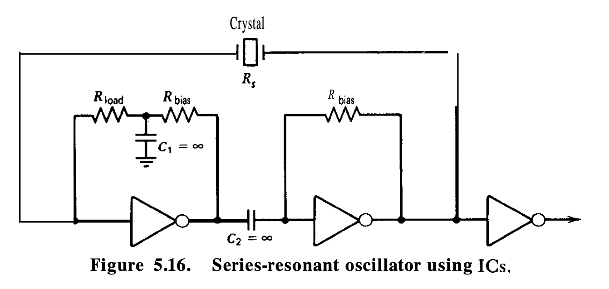

How does the Apple1 render its display? This page will explain the rendering process of the Apple1.

## A Brief Overview of the Apple1 

The Apple1 is a computer on a single circuit board. It can be separated into three main sections: The processor Section, the Terminal Section and the Power Supply.

In this page we will focus on the Terminal Section. The Terminal Section is responsible for providing a video signal that can be displayed on a monitor. The Terminal Section consists of a some kind of video memory, a character generator, and a video output circuit.

## How it's (supposed to) work

The Apple1 uses bit shift registers as video memory. The video memory is a 1Kx1 bit memory. The video memory is used to store the video data that is displayed on the screen. The video memory is read by the video output circuit and the character generator to generate the video signal that is displayed on the monitor.

## Quick Analysis of the Terminal Section Diagram

We can see that... it a lot of stuff. As genius as the Apple1 is, the resulting diagram seems to be a bit of a mess. 

## The Crystal Oscillator Circuit

After looking a bit at [this document](https://bgaudioclub.org/uploads/docs/Crystal_Oscillator_Circuits_Krieger_Matthys.pdf), this seems to be an (early) version of a Series-resonant oscillator using ICs (Page 44). There are a few differences, namely:
* the use of two 0.1uF capacitors as load capacitors
* the removal of the R_load resistor (that is supposed to offset the resistance of the crystal)
* the absence of a ground connection between the R_load resistor and the crystal.
* the absence of (theoratical) infinite capacitance between the crystal and the ground, and between the two inverters.

This type of circuit was quite common in the 70s and 80s, and was used in many computers of the time. You can find another design close to this one in the [Z80 Crystal Oscillator Circuits Page](http://www.z80.info/uexosc.htm), where a 10nF capacitor to the ground is used as a load capacitor instead of one of the 0.1uF capacitors (giving more stability to the circuit).

Wait... does it *really* give more stability to the circuit? Let's test it on a breadboard and see if it works.

